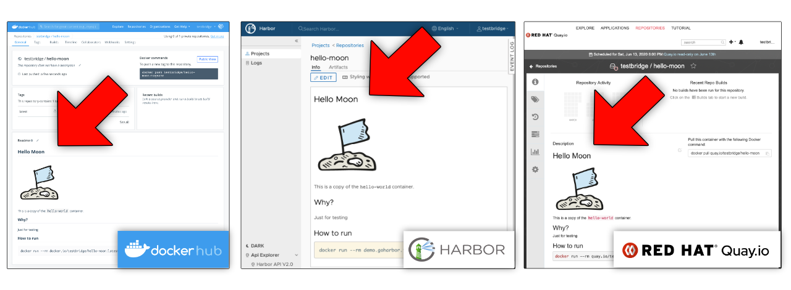

# Docker Push Readme

Update the README of your container repo on Dockerhub, Quay or Harbor with a simple Docker command:

```
$ ls
README.md
$ docker pushrm my-user/hello-world
```



## About

`docker-pushrm` is a Docker CLI plugin that adds a new `docker pushrm` (speak: *"push readme"*) command to Docker.

It pushes the README file from the current working directory to a container registry server where it appears as repo description in the webinterface.

It currently supports **[Dockerhub](https://hub.docker.com)** (cloud), **Red Hat Quay** ([cloud](https://quay.io) and [self-hosted](https://www.openshift.com/products/quay)/OpenShift) and **[Harbor v2](https://goharbor.io)** (self-hosted).

For most registry types `docker-pushrm` uses authentication info from the Docker credentials store - so it "just works" for registry servers that you're already logged into with Docker.

(For some other registry types, you'll need to pass an API key via env var or config file).

## Usage example

Let's build a container image, push it to Dockerhub and then also push the README to Dockerhub:

```
$ ls
Dockerfile	README.md
$ docker login
Username: my-user
Passwort: ********
Login Succeeded
$ docker build -t my-user/hello-world .
$ docker push my-user/hello-world
$ docker pushrm my-user/hello-world
```

When we now browse to the repo in the Dockerhub webinterface we should find the repo's README to be updated with the contents of the local README file.

The same works for Harbor version 2 registry servers:

```
docker pushrm --provider harbor2 demo.goharbor.io/myproject/hello-world
```

And also for Quay/OpenShift cloud and self-hosted registry servers:
```
docker pushrm --provider quay quay.io/my-user/hello-world
```

In case that you want different content to appear in the README on the container registry than on the git repo (for github/gitlab), you can create a dedicated `README-containers.md`, which takes precedence.

## Installation

- make sure Docker or Docker Desktop is installed
- Download `docker-pushrm` for your platform from the [release page](https://github.com/christian-korneck/docker-pushrm/releases/latest).
- copy it to:
  - Windows: `c:\Users\<your-username>\.docker\cli-plugins\docker-pushrm.exe`
  - Mac + Linux: `$HOME/.docker/cli-plugins/docker-pushrm`
- on Mac/Linux make it executable: `chmod +x $HOME/.docker/cli-plugins/docker-pushrm`

Now you should be able to run `docker pushrm --help`.

## How to log in to container registries

### Log in to Dockerhub registry

```
docker login
```

### Log in to Harbor v2 registry

```
docker login <servername>
```

Example:
```
docker login demo.goharbor.io
```

### Log in to Quay registry

If you want to be able to push containers, you need to log in as usual:

- for Quay cloud: `docker login quay.io`
- for self-hosted Quay server or OpenShift: `docker login <servername>` (example: `docker login my-server.com`)

In addition to be able to use `docker-pushrm` you need to set up an API key:

First, log into the Quay webinterface and create an API key:
- if you don't have an organization create a new organization (your repos don't need to be under the organization's namespace, this is just to unlock the "apps" settings page)
- navigate to the org and open the `applications` tab
- `create new app` and give it some name
- click on the app name and open to the `generate token` tab
- create a token with permissions `Read/Write to any accessible repositories`
- after confirming you should now see the token secret. Write it down in a safe place.

(Refer to the Quay docs for more info)

Then, make the API key available to `docker-pushrm`. There are two options for that: Either set an environment variable (recommended for CI) or add it to the Docker config file (recommended for Desktop use). (If both are present, the env var takes precedence).

#### env var for Quay API key
set an environment variable `APIKEY__<SERVERNAME>_<DOMAIN>=<apikey>`

example for servername `quay.io`:
```
export APIKEY__QUAY_IO=my-api-key
docker pushrm quay.io/my-user/my-repo
```

#### configure Quay API key in Docker config file

In the Docker config file (default: `$HOME/.docker/config.json`) add a json key `plugins.docker-pushrm.apikey_<servername>` with the api key as string value.

Example for servername `quay.io`:

```
{

  ...,


  "plugins" : {
    "docker-pushrm" : {
      "apikey_quay.io" : "my-api-key"
    }
  },

  ...
}
```


## What if I use [podman, img, k3c, buildah, ...] instead of Docker?

You can still use `docker-pushrm` as standalone executable.

The only obstacle is that you need to provide it credentials in the Docker style.

The easiest way for that is to set up a minimal Docker config file with the registry server logins that you need.

You can either create this config file on a computer with Docker installed (by running `docker login` and then copying the `$HOME/.docker/config.json` file).

Or alternatively you can also set it up manually. Here's an example:

```
{
	"auths": {
		"https://index.docker.io/v1/": {
			"auth": "xxx"
		},
        "https://demo.harbor.io": {
			"auth": "xxx"
		}

	},
}
```
The auth value is base64 of `<user>:<passwd>` (i.e. `myuser:mypasswd`)

It's also possible to use Docker [credential helpers](https://docs.docker.com/engine/reference/commandline/login/#credential-helpers) on systems that don't have Docker installed to avoid clear text passwords in the config file. The credential helper needs to be configured in the Docker config file and the credential helper executable needs to be in the `PATH`. (Check the Docker docs for details).

## Can you add support for registry [XY...]?

Please open an issue.

## Installation for all users

To install the plugin for all users of a system copy it to the following path (instead of to the user home dir). Requires admin/root privs.

- Linux: depending on the distro, either `/usr/lib/docker/cli-plugins/docker-pushrm` or `/usr/libexec/docker/cli-plugins/docker-pushrm`
- Windows: `%ProgramData%\Docker\cli-plugins\docker-pushrm.exe`
- Mac: `/Applications/Docker.app/Contents/Resources/cli-plugins/docker-pushrm`

On Mac/Linux make it executable and readable for all users: `chmod a+rx <path>/docker-pushrm`

## Limitations

### Conflict with Dockerhub personal access tokens and 2FA auth

Pushing READMEs to Dockerhub currently only works with username/password and **not** with [personal access tokens](https://docs.docker.com/docker-hub/access-tokens/). If you have [2FA auth](https://docs.docker.com/docker-hub/2fa/) (two-factor authentication) enabled for your Dockerhub account you're effectively using a personal access token. This is an unfortunate Dockerhub API limitation.

There are indications (in issues and forum posts) that a new API for Dockerhub might be coming up sooner or later that might fill this gap. Fingers crossed. 🤞


----
All trademarks, logos and website designs belong to their respective owners.
